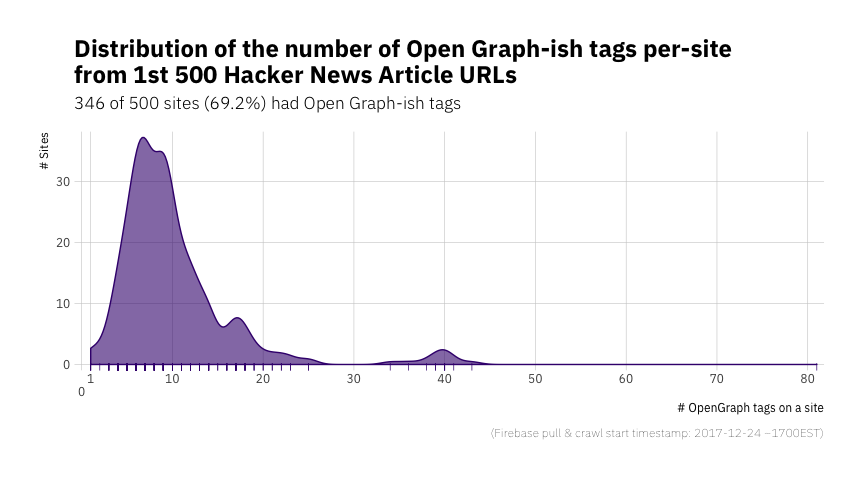

# opengraph

Tools to Mine ‘Open Graph’-like Tags From ‘HTML’ Content

## Description

Many services such as ‘Facebook’ and ‘Twitter’ rely on ‘Open Graph’-like
tags (<http://ogp.me/>) to build a formalized knowledge graph from
‘HTML’ content metadata. Tools are providfed to extract and analyze
this data.

## What’s Inside The Tin

The following functions are implemented:

  - `read_properties`: Read Open Graph tags from an HTML document
  - `is_valid_property`: Is an property valid?

## Installation

``` r
devtools::install_github("hrbrmstr/opengraph")
```

## Usage

``` r
library(opengraph)
library(jsonlite)
library(hrbrthemes)
library(tidyverse)

# current verison
packageVersion("opengraph")
```

    ## [1] '0.1.0'

### Tag Distribution

``` r
rt <- rprojroot::find_package_root_file()

if (!file.exists(file.path(rt, "ex", "tags.rds"))) {

# Hacker News current top 500 ~1700 EST 2017-12-24
x <- jsonlite::fromJSON("https://hacker-news.firebaseio.com/v0/topstories.json")

# Get the metadat for each one
pb <- progress_estimated(length(x))
sprintf("https://hacker-news.firebaseio.com/v0/item/%s.json", x) %>% 
  map(~{
    pb$tick()$print()
    jsonlite::fromJSON(.x)
  }) -> stories

# Deal with any HTTP or parsing errors
s_read_props <- purrr::safely(opengraph::read_properties)

# Go to each site & pull the metadata from it
map(stories, "url") %>% 
  flatten_chr() %>% 
  map_df(~{
    cat(".")
    res <- s_read_props(.x) 
    if (is.null(res$result)) return(data_frame(orig_url = .x))
    mutate(res$result, orig_url = .x)
  }) -> tags

# Don't waste bandwidth
write_rds(tags, file.path(rt, "ex", "tags.rds"))

} else {
  tags <- read_rds(file.path(rt, "ex", "tags.rds"))
}

# Which ones are valid?
tags <- mutate(tags, is_valid = is_valid_property(property))

filter(tags, is_valid) %>% 
  count(is_valid, orig_url) -> valid_sites

nsites <- length(unique(valid_sites$orig_url))
```

``` r
ggplot() +
  ggalt::geom_bkde(data=valid_sites, aes(n, y=..count..), color="#3f007d", fill="#3f007d", size=0.5, alpha=3/5, bandwidth=1) +
  geom_rug(data=valid_sites, aes(n), color="#3f007d", size=0.25) +
  scale_x_comma(limits=c(0, NA), 
                breaks=sort(c(1, seq(0, 90, 10))),
                labels=c("\n0", 1, seq(0, 90, 10)[-1])) +
  scale_y_continuous(expand=c(0,1)) +
  labs(x="# OpenGraph tags on a site",
       y="# Sites", 
       title="Distribution of the number of Open Graph-ish tags per-site\nfrom 1st 500 Hacker News Article URLs",
       subtitle=sprintf("%s of 500 sites (%s) had Open Graph-ish tags", nsites, scales::percent(nsites/500)),
       caption="(Firebase pull & crawl start timestamp: 2017-12-24 ~1700EST)") +
  theme_ipsum_ps(grid="XY")
```

<!-- -->

### Top 20 Tags

``` r
filter(tags, is_valid) %>% 
  count(property, sort=TRUE) %>% 
  head(20) %>% 
  knitr::kable()
```

| property                |   n |
| :---------------------- | --: |
| og:title                | 348 |
| og:image                | 341 |
| og:description          | 335 |
| og:url                  | 331 |
| og:type                 | 320 |
| fb:pages                | 302 |
| og:site\_name           | 288 |
| article:tag             | 249 |
| fb:app\_id              | 166 |
| article:published\_time | 114 |
| article:author          |  84 |
| og:locale               |  83 |
| og:image:width          |  78 |
| og:image:height         |  77 |
| og:see\_also            |  70 |
| article:modified\_time  |  66 |
| article:section         |  65 |
| fb:admins               |  62 |
| og:updated\_time        |  30 |
| twitter:image           |  27 |
